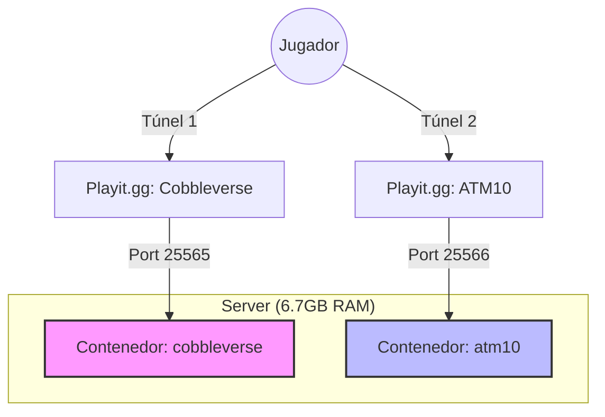

# 🎮 Infraestructura Minecraft Dual (Docker)

**Estado:** 🟢 Operativo
**Servidor Host:** `192.168.0.6` (Ubuntu Server)
**Gestión:** Docker + Scripts Bash
**Restricción Crítica:**  NUNCA encender ambos servidores simultáneamente.

---
## Conectado a estos servidores:
- [[ATM 10 Lite]]
-  [[Cobbleverse]]
##  Arquitectura del Sistema

El sistema utiliza **dos contenedores** separados que comparten el hardware pero usan puertos distintos. La gestión de RAM se controla vía scripts que apagan uno antes de encender el otro.

## Comandos basicos
> [!INFO] Comandos
> jugar-atm.sh
> jugar-cobbleverse.sh
> stop-all.sh